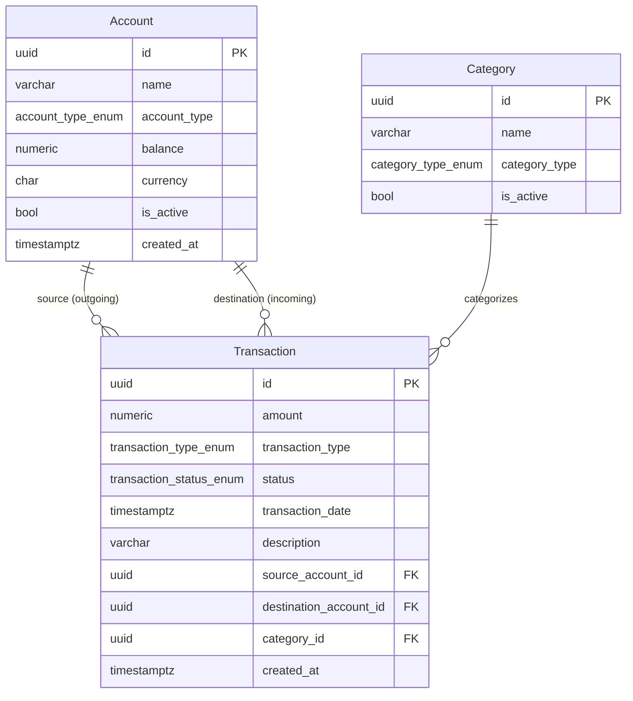

# Modelo de Dados: Infraestrutura Base e Servidor MCP de Finanças

**Feature**: `001-core-infra-mcp`
**Data**: 2026-09-19
**Status**: Definido

---

## Entidades

### `Account` — Conta Financeira

Representa uma fonte ou destino de recursos financeiros (conta corrente, poupança, carteira, investimento).

| Campo | Tipo Python | Tipo SQL | Restrições |
| :--- | :--- | :--- | :--- |
| `id` | `uuid.UUID` | `UUID PRIMARY KEY` | PK, gerado automaticamente |
| `name` | `str` | `VARCHAR(100) NOT NULL` | `min_length=1`, `max_length=100`, indexado |
| `account_type` | `AccountType` | `account_type_enum NOT NULL` | Enum nativo: `checking`, `savings`, `investment`, `cash` |
| `balance` | `Decimal` | `NUMERIC(14,2) NOT NULL` | `default=0.00`, `ge=0` não forçado (saldo pode ser negativo em cheque especial) |
| `currency` | `str` | `CHAR(3) NOT NULL` | `default="BRL"`, pattern `^[A-Z]{3}$` |
| `is_active` | `bool` | `BOOLEAN NOT NULL` | `default=True` — soft delete |
| `created_at` | `datetime` | `TIMESTAMPTZ NOT NULL` | `default=now()`, timezone-aware |

**Relacionamentos**:
- `outgoing_transactions` → `Transaction[]` (FK: `Transaction.source_account_id`)
- `incoming_transactions` → `Transaction[]` (FK: `Transaction.destination_account_id`)

**Enums — `AccountType`**:
```python
class AccountType(StrEnum):
    CHECKING   = "checking"
    SAVINGS    = "savings"
    INVESTMENT = "investment"
    CASH       = "cash"
```

---

### `Category` — Categoria Financeira

Agrupador conceitual de movimentações financeiras (ex: "Alimentação", "Salário").

| Campo | Tipo Python | Tipo SQL | Restrições |
| :--- | :--- | :--- | :--- |
| `id` | `uuid.UUID` | `UUID PRIMARY KEY` | PK, gerado automaticamente |
| `name` | `str` | `VARCHAR(100) NOT NULL` | `unique=True`, `min_length=1`, `max_length=100`, indexado |
| `category_type` | `CategoryType` | `category_type_enum NOT NULL` | Enum nativo: `income`, `expense` |
| `is_active` | `bool` | `BOOLEAN NOT NULL` | `default=True` — soft delete |

**Relacionamentos**:
- `transactions` → `Transaction[]` (FK: `Transaction.category_id`)

**Enums — `CategoryType`**:
```python
class CategoryType(StrEnum):
    INCOME  = "income"
    EXPENSE = "expense"
```

---

### `Transaction` — Transação Financeira

Registro imutável de uma movimentação financeira (receita, despesa ou transferência).

| Campo | Tipo Python | Tipo SQL | Restrições |
| :--- | :--- | :--- | :--- |
| `id` | `uuid.UUID` | `UUID PRIMARY KEY` | PK, gerado automaticamente |
| `amount` | `Decimal` | `NUMERIC(14,2) NOT NULL` | `gt=0` — valor deve ser positivo |
| `transaction_type` | `TransactionType` | `transaction_type_enum NOT NULL` | Enum nativo: `income`, `expense`, `transfer` |
| `status` | `TransactionStatus` | `transaction_status_enum NOT NULL` | `default=cleared`; `cleared` ou `pending` |
| `transaction_date` | `datetime` | `TIMESTAMPTZ NOT NULL` | timezone-aware; aceita datas futuras (agendamento) |
| `description` | `str` | `VARCHAR(255) NOT NULL` | `default=""`, `max_length=255` |
| `source_account_id` | `uuid.UUID` | `UUID NOT NULL` | FK → `account.id` `ON DELETE RESTRICT`, indexado |
| `destination_account_id` | `uuid.UUID \| None` | `UUID NULL` | FK → `account.id` `ON DELETE RESTRICT`, indexado; obrigatório se `transfer` |
| `category_id` | `uuid.UUID \| None` | `UUID NULL` | FK → `category.id` `ON DELETE RESTRICT`, indexado |
| `created_at` | `datetime` | `TIMESTAMPTZ NOT NULL` | `default=now()`, timezone-aware |

**Relacionamentos**:
- `source_account` → `Account` (FK: `source_account_id`)
- `destination_account` → `Account \| None` (FK: `destination_account_id`)
- `category` → `Category \| None` (FK: `category_id`)

**Enums — `TransactionType`**:
```python
class TransactionType(StrEnum):
    INCOME   = "income"
    EXPENSE  = "expense"
    TRANSFER = "transfer"
```

**Enums — `TransactionStatus`**:
```python
class TransactionStatus(StrEnum):
    CLEARED = "cleared"
    PENDING = "pending"
```

**Regras de domínio**:
- `amount > 0` sempre (valor positivo; a direção é determinada por `transaction_type`)
- Se `transaction_type == "transfer"`, `destination_account_id` é obrigatório e diferente de `source_account_id`
- Transferência opera em transação ACID: débito em `source_account.balance` + crédito em `destination_account.balance` atomicamente
- Status `pending` afeta saldo projetado mas não o saldo liquidado (`cleared`)

---

## Diagrama de Entidade-Relacionamento



---

## Regras de Integridade Referencial

| FK | ON DELETE | Justificativa |
| :--- | :--- | :--- |
| `Transaction.source_account_id` → `Account` | `RESTRICT` | Não permite deletar conta com transações — histórico financeiro é imutável |
| `Transaction.destination_account_id` → `Account` | `RESTRICT` | Idem |
| `Transaction.category_id` → `Category` | `RESTRICT` | Preserva rastreabilidade de categorias em uso |

Soft delete via `is_active = False` em `Account` e `Category` é a estratégia preferida para "remover" registros em uso.

---

## Tipos Enum no PostgreSQL

| Nome do Tipo | Valores |
| :--- | :--- |
| `account_type_enum` | `checking`, `savings`, `investment`, `cash` |
| `category_type_enum` | `income`, `expense` |
| `transaction_type_enum` | `income`, `expense`, `transfer` |
| `transaction_status_enum` | `cleared`, `pending` |

> **Atenção para Alembic**: `ALTER TYPE ... ADD VALUE` no PostgreSQL não é transacional. Novos valores de enum devem ser adicionados fora de blocos de transação na migração. Avaliar `native_enum=False` se expansão frequente de enums for prevista.

