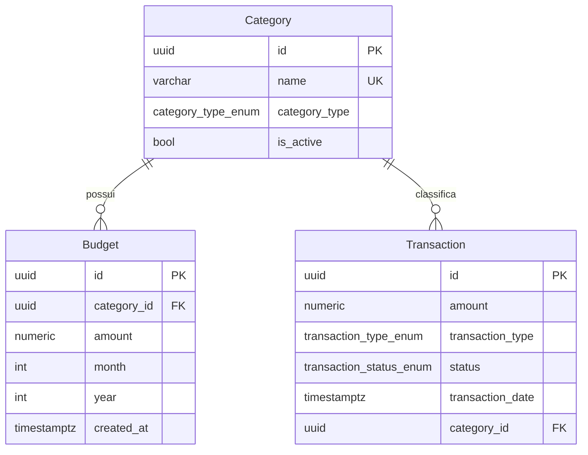

# Modelo de Dados: Gestão de Categorias e Orçamentos

**Feature**: `002-categories-and-budgets`
**Data**: 2026-09-19

---

## Entidades

### `Category` (Existente, a ser complementada com ferramentas)

| Campo | Tipo Python | Tipo SQL | Restrições |
| :--- | :--- | :--- | :--- |
| `id` | `uuid.UUID` | `UUID PRIMARY KEY` | PK gerada automaticamente |
| `name` | `str` | `VARCHAR(100) UNIQUE NOT NULL` | Indexada |
| `category_type` | `CategoryType` | `category_type_enum NOT NULL` | Enum: `income`, `expense` |
| `is_active` | `bool` | `BOOLEAN NOT NULL` | Default `True` |

---

### `Budget` (Nova Entidade)

Representa o teto de gastos estipulado para uma categoria em um período mensal.

| Campo | Tipo Python | Tipo SQL | Restrições |
| :--- | :--- | :--- | :--- |
| `id` | `uuid.UUID` | `UUID PRIMARY KEY` | PK gerada automaticamente |
| `category_id` | `uuid.UUID` | `UUID NOT NULL` | FK → `category.id` `ON DELETE RESTRICT` |
| `amount` | `Decimal` | `NUMERIC(14,2) NOT NULL` | `gt=0` (valor deve ser estritamente positivo) |
| `month` | `int` | `INTEGER NOT NULL` | 1 <= `month` <= 12 |
| `year` | `int` | `INTEGER NOT NULL` | Ex: 2026 |
| `created_at` | `datetime` | `TIMESTAMPTZ NOT NULL` | Default `now()` com timezone UTC |

**Constraints de Tabela**:
- `UniqueConstraint("category_id", "month", "year", name="uq_budget_category_period")`

**Relacionamentos**:
- `category` → `Category`

---

## Diagrama de Entidade-Relacionamento

