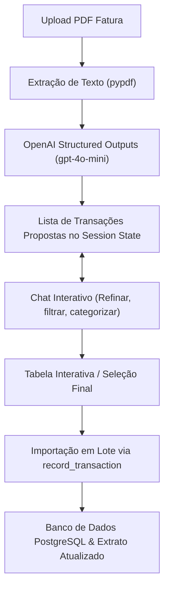

# Implementation Plan: Leitura de Fatura PDF com Chat Interativo e Lançamento (005-invoice-pdf-chat)

## 1. Arquitetura e Fluxo de Dados

## 2. Dependências Necessárias
- Biblioteca leve de leitura de texto de PDFs: `pypdf>=4.0` (em Python puro, compatível com o container e `uv`).
- A biblioteca `openai>=1.0` já está presente no `pyproject.toml`.

## 3. Componentes a Implementar

### A. Módulo de Serviços de IA e Extração de PDF
- **`src/contas/services/invoice_parser.py`**:
  - `extract_text_from_pdf(pdf_bytes: bytes) -> str`: lê o texto cru das páginas da fatura.
  - `parse_invoice_items(raw_text: str, existing_categories: list[str]) -> list[ExtractedInvoiceItem]`:
    - Define schema Pydantic com `amount`, `description`, `date`, `category_suggestion`, `installment_current`, `installment_total`.
    - Executa chamada com `client.beta.chat.completions.parse` usando OpenAI Structured Outputs.
  - `chat_refine_items(current_items: list[dict], user_prompt: str, categories: list[str]) -> tuple[list[dict], str]`:
    - Processa o pedido do usuário no chat (ex: "remova compras de farmácia", "mude categoria X para Y", "filtre apenas acima de 100") e retorna a lista atualizada de itens e a resposta textual do assistente.

### B. Interface Streamlit
- **Nova aba no menu de navegação em `src/contas/ui/app.py`**: **"🧾 Importar Fatura PDF"**:
  - Seção 1: Upload do arquivo PDF (`st.file_uploader`) e seleção da conta de lançamento.
  - Seção 2: Visualização da lista de despesas encontradas com métricas (Total da Fatura, Qtd. de Compras).
  - Seção 3: Chat interativo integrado (`st.chat_message`, `st.chat_input`) que permite comandar o filtro e ajustes nos lançamentos.
  - Seção 4: Tabela com seleção de checkboxes e botão para **"Confirmar e Lançar no Sistema"**.

### C. Testes Automatizados
- `tests/unit/test_invoice_parser.py`:
  - Testes com mocks de PDF e respostas da OpenAI para validar parsing e conversão de valores decimais e datas.
- `tests/integration/test_invoice_flow.py`:
  - Teste de ponta a ponta da importação das transações filtradas para a base de dados.

