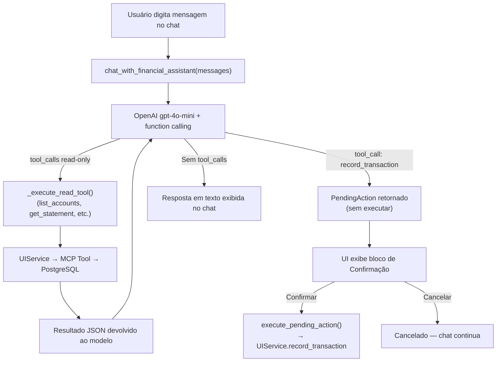

# Implementation Plan: Assistente Financeiro por Chat (006-financial-chat-assistant)

## 1. Arquitetura e Fluxo de Dados

## 2. Componentes a Implementar

### A. Serviço de Chat

**`src/contas/services/financial_chat.py`** (novo):
- `_TOOLS: list[dict]` — schemas JSON de 6 ferramentas para o model.
- `@dataclass PendingAction` — representa ação de escrita pendente de confirmação.
- `chat_with_financial_assistant(messages, client, model) -> (reply, PendingAction | None)` — loop agentic com até 6 iterações.
- `execute_pending_action(pending) -> dict` — executa ação confirmada pelo usuário.
- `_execute_read_tool(name, args, accounts, categories) -> str` — despacha ferramentas de leitura.
- `_build_action_summary(name, args, ...) -> str` — gera texto legível para o bloco de confirmação.

### B. Interface Streamlit

**`src/contas/ui/app.py`** (modificar):
- Adicionar `"💬 Assistente Financeiro"` no `st.sidebar.radio`.
- Nova seção `elif menu == "💬 Assistente Financeiro":` com:
  - Importação de `chat_with_financial_assistant`, `execute_pending_action`, `PendingAction`.
  - Inicialização de `st.session_state["financial_chat_history"]` e `st.session_state["pending_action"]`.
  - Renderização do histórico com `st.chat_message`.
  - `st.chat_input` para nova mensagem do usuário.
  - `st.spinner` durante chamada ao assistente.
  - Bloco de confirmação (`st.warning` + botões "✅ Confirmar" / "❌ Cancelar") quando `pending_action` não for `None`.
  - Botão "🗑️ Limpar Conversa" na barra lateral.

### C. UIService

**`src/contas/ui/services.py`** (modificar):
- Adicionar `UIService.get_financial_summary(month, year)` — wrapper da tool `get_financial_summary` já existente no MCP server.

### D. Testes Automatizados

**`tests/unit/test_financial_chat.py`** (novo):
- `test_simple_reply_no_tools` — modelo responde sem tool_calls, retorna `(reply, None)`.
- `test_tool_call_list_accounts` — modelo chama `list_accounts`, serviço executa e retorna resposta final.
- `test_write_tool_returns_pending_action` — modelo chama `record_transaction`, retorna `(reply, PendingAction)` sem executar.
- `test_execute_pending_action_success` — `execute_pending_action` chama `UIService.record_transaction` corretamente.
- `test_build_action_summary` — verifica formatação da string de confirmação.

## 3. Dependências

Nenhuma nova dependência externa — `openai` e `streamlit` já presentes.

## 4. Ordem de Implementação

1. `UIService.get_financial_summary` → serviço de suporte.
2. `financial_chat.py` → lógica central.
3. Testes unitários com mocks → validação TDD.
4. Seção de chat no `app.py` → interface.
5. Ruff + pytest → validação final.
6. Commit e push na branch `feature/006-financial-chat`.
