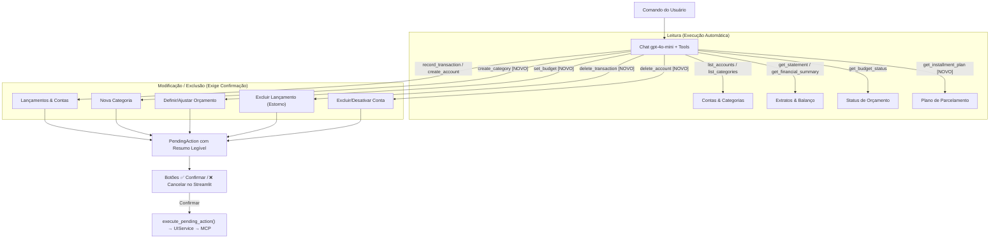

# Implementation Plan: Cobertura Completa de Ferramentas MCP no Chat Financeiro (007-chat-full-mcp-tools)

## 1. Arquitetura e Classificação de Ferramentas

## 2. Detalhamento dos Componentes

### A. Módulo de Chat (`src/contas/services/financial_chat.py`)
1. **Novas ferramentas em `_TOOLS`**:
   - `create_category`: `name`, `category_type` ("income" ou "expense").
   - `set_budget`: `category_name`, `amount`, `month`, `year`.
   - `get_installment_plan`: `installment_id`.
   - `delete_transaction`: `transaction_id`, `description`, `delete_all_installments` (bool).
   - `delete_account`: `account_name`, `account_id`, `force_cascade` (bool).
2. **Atualização de `_WRITE_TOOLS`**:
   - Adicionar `create_category`, `set_budget`, `delete_transaction`, `delete_account`.
3. **Dispatcher de Leitura (`_execute_read_tool`)**:
   - Suporte a `get_installment_plan(installment_id)`.
4. **Executor de Confirmação (`execute_pending_action`)**:
   - `create_category` → chama `UIService.create_category`.
   - `set_budget` → resolve ID da categoria e chama `UIService.set_budget`.
   - `delete_transaction` → chama `UIService.delete_transaction`.
   - `delete_account` → resolve ID da conta e chama `UIService.delete_account`.
5. **Formatador de Resumo (`_build_action_summary`)**:
   - Textos de alerta claros e com detalhes de valores e consequências de exclusão.
6. **Atualização do `SYSTEM_PROMPT`**:
   - Instruir a IA a pesquisar o extrato ou listar contas se o usuário pedir exclusão por nome/descrição, passando o `id` encontrado para a ferramenta de exclusão.

### B. Interface Streamlit (`src/contas/ui/app.py`)
- O bloco de confirmação de `pending_action` já existente foi desenhado para ser agnóstico à ferramenta: exibe `pending.summary` e despacha para `execute_pending_action`.
- Apenas garantir mensagens de retorno apropriadas caso a ação executada seja de criação, alteração ou exclusão.

### C. Testes Unitários (`tests/unit/test_financial_chat.py`)
- Teste para `create_category` gerando `PendingAction` e executando.
- Teste para `set_budget` com resolução de categoria.
- Teste para `delete_transaction` com confirmação e estorno.
- Teste para `delete_account` com confirmação.
- Teste para `get_installment_plan` (leitura imediata).

## 3. Plano de Verificação
- `uv run ruff check . && uv run ruff format --check .`
- `uv run pytest -v` (todos os testes passando com mocks).
