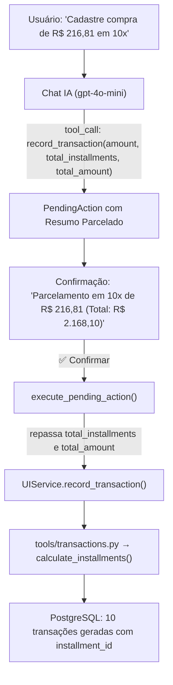

# Implementation Plan: Registro e Gestão de Compras Parceladas via Chat (008-chat-installment-purchases)

## 1. Arquitetura e Fluxo

## 2. Componentes a Modificar

### A. Módulo de Chat (`src/contas/services/financial_chat.py`)
1. **Schema em `_TOOLS["record_transaction"]`**:
   - Adicionar `total_installments` (integer): "Quantidade total de parcelas (ex: 10). Use quando a compra for parcelada."
   - Adicionar `total_amount` (string): "Valor total da compra caso fornecido (ex: '2168.10'). Se fornecido apenas o valor da parcela em `amount`, calcule `total_amount = amount * total_installments`."
2. **Executor `execute_pending_action`**:
   - Extrair `total_installments = args.get("total_installments")`
   - Extrair `total_amount = args.get("total_amount")`
   - Se `total_installments > 1` e `total_amount` for nulo, mas `amount` foi informado:
     - Calcular `total_amount = f"{Decimal(amount) * total_installments:.2f}"`
   - Repassar ambos para `UIService.record_transaction`.
3. **Resumo `_build_action_summary`**:
   - Quando `total_installments > 1`:
     - Exibir claramente: `**Despesa Parcelada** em **{total_installments}x** de **{amount_fmt}** (Total: **{total_amount_fmt}**)`.
4. **Instrução no `SYSTEM_PROMPT`**:
   - Adicionar diretriz explícita para compras parceladas: quando o usuário disser "em X vezes", "parcelado em X vezes", preencher obrigatoriamente `total_installments` e calcular `total_amount`.

### B. Testes Unitários (`tests/unit/test_financial_chat.py`)
- Adicionar teste para `record_transaction` com parcelamento (validação de `PendingAction`, `summary` e repasse para `UIService.record_transaction`).
