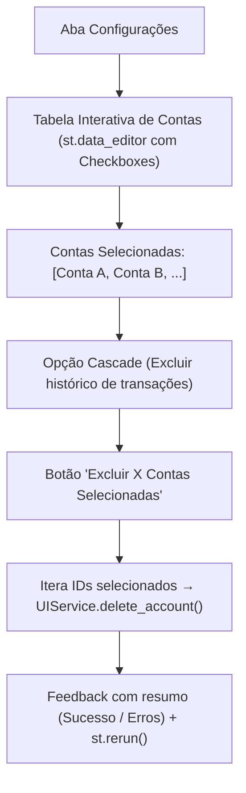

# Implementation Plan: Exclusão em Lote de Contas em Configurações (009-bulk-delete-accounts)

## 1. Arquitetura e Interface

## 2. Componentes a Modificar

### A. Interface Streamlit (`src/contas/ui/app.py`)
Na seção de **⚙️ Configurações**:
- Substituir ou aprimorar o bloco "🗑️ Gerenciar e Excluir Contas":
  - Oferecer uma tabela interativa usando `st.data_editor` com coluna booleana `Selecionar` ou um `st.multiselect` intuitivo com resumo dos dados da conta (Nome, Tipo, Saldo, Status).
  - Um `st.data_editor` com `Selecionar`, `Nome`, `Tipo`, `Saldo` e `Ativa` permite marcar várias ou todas de uma vez com um clique.
  - Checkbox para `force_cascade`.
  - Botão de ação: `🗑️ Excluir Selecionadas (N)`.
  - Ao clicar, exibe modal ou confirmação direta, executa `UIService.delete_account` para cada conta selecionada e exibe relatório de resultados.

### B. Testes
- Adicionar teste unitário validando a chamada em lote de exclusão no `UIService`.
- Validar `ruff` e suíte completa com `pytest`.
