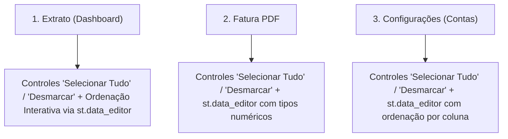

# Implementation Plan: Selecionar Tudo e Ordenação de Colunas em Tabelas (010-table-select-all-and-sort)

## 1. Arquitetura e Estrutura de Interface

## 2. Detalhes de Implementação

### A. Extrato de Movimentações (`src/contas/ui/app.py`)
- Substituir o `st.dataframe` estático por `st.data_editor` com coluna booleana `"Selecionar"`.
- Adicionar botões de atalho `"☑️ Selecionar Tudo"` e `"⬜ Desmarcar Tudo"` (ou checkbox mestre controlado via `st.session_state`).
- Configurar colunas formatadas: `st.column_config.NumberColumn` para valor (permitindo ordenação numérica nativa), `st.column_config.DateColumn`/`TextColumn` para data e texto.
- Adicionar ação de exclusão em lote para as transações selecionadas diretamente a partir da tabela.

### B. Importação de Fatura PDF (`src/contas/ui/app.py`)
- Adicionar botões `"☑️ Selecionar Tudo"` e `"⬜ Desmarcar Tudo"` acima do `st.data_editor`.
- O estado de seleção deve persistir e refletir na coluna `"Importar"`.
- Manter ordenação por cabeçalho no `st.data_editor` garantindo tipo `NumberColumn` na coluna `Valor`.

### C. Gerenciador de Contas em Configurações (`src/contas/ui/app.py`)
- Adicionar controles `"☑️ Selecionar Tudo"` e `"⬜ Desmarcar Tudo"` acima da tabela `editor_accounts_bulk_delete`.
- Atualizar o estado da tabela quando o usuário acionar o controle mestre.

### D. Testes Unitários e Validação
- Validar comportamento com testes unitários em `tests/unit/test_ui_services.py` ou teste dedicado.
- Executar `ruff check` e `pytest`.
