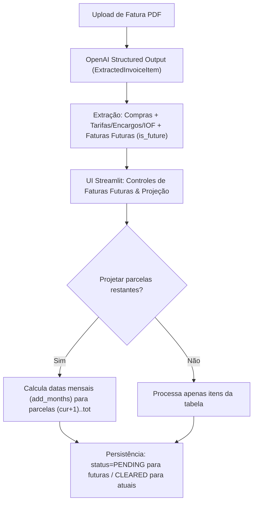

# Implementation Plan: Transações Futuras, Encargos e Projeção de Parcelas na Importação de Faturas (011-invoice-future-transactions-and-charges)

## 1. Arquitetura e Fluxo

## 2. Detalhes de Implementação

### A. Parser de Faturas (`src/contas/services/invoice_parser.py`)
- Adicionar `is_future: bool = Field(default=False, ...)` no modelo `ExtractedInvoiceItem`.
- Atualizar as diretrizes do prompt do sistema (`system_prompt`) para orientar a extração de encargos financeiros, juros, tarifas e sinalizar transações futuras (`is_future=True`).

### B. Camada de Serviços da UI (`src/contas/ui/services.py`)
- Adicionar `status: str = "cleared"` e `installment_number: int | None = None` ao método `UIService.record_transaction`.
- Propagar esses campos para a construção do `RecordTransactionInput`.

### C. Interface Streamlit (`src/contas/ui/app.py`)
- Adicionar checkboxes de configuração:
  - `"📅 Listar lançamentos de faturas futuras"` (filtra visualização caso desmarcado).
  - `"🔮 Projetar e lançar parcelas futuras restantes como pendentes"` (gera parcelas restantes automaticamente).
- Adicionar coluna `"Fatura Futura?"` configurada com `st.column_config.CheckboxColumn`.
- Na rotina de confirmação:
  - Definir `status = TransactionStatus.PENDING if row["Fatura Futura?"] else TransactionStatus.CLEARED`.
  - Se a projeção de parcelas estiver ativada e `installment_current < installment_total`, iterar de `cur+1` até `total` chamando `add_months` e gravando com status `pending`.

### D. Testes e Validação
- Testar schema `ExtractedInvoiceItem` com `is_future`.
- Testar schema `RecordTransactionInput` com status pendente e parcelas.
- Testar chamada do `UIService.record_transaction` validando o payload gerado.
- Validar conformidade de código com `ruff check` e `ruff format`.
