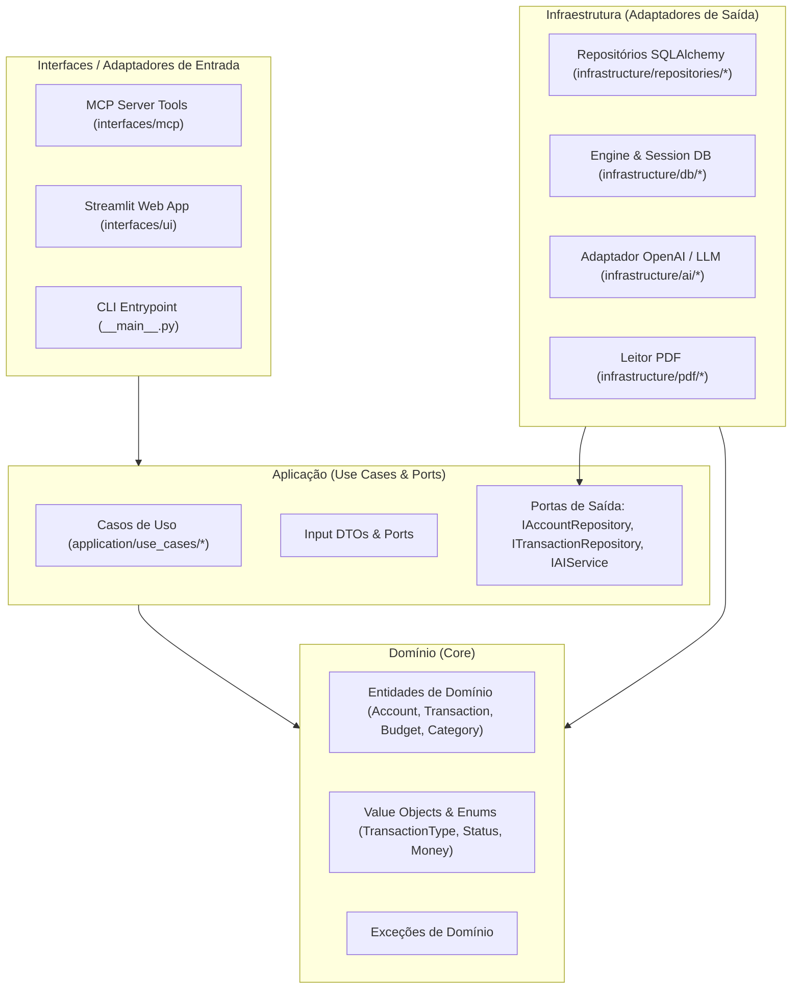

# Implementation Plan: Refatoração para Clean Architecture (012-clean-architecture-refactoring)

## 1. Visão Geral da Arquitetura Alvo

A arquitetura seguirá os princípios clássicos de Clean Architecture e Ports & Adapters:

---

## 2. Mapeamento de Diretórios

| Caminho Atual | Nova Localização (Clean Architecture) | Responsabilidade |
| :--- | :--- | :--- |
| `src/contas/models/*` | `src/contas/domain/entities/*` e `src/contas/infrastructure/db/models/*` | Entidades puras de domínio vs. mapeamento relacional SQLAlchemy ORM |
| `src/contas/schemas/*` | `src/contas/application/dtos/*` | DTOs de entrada e saída da camada de aplicação |
| `src/contas/tools/transactions.py`, etc. | `src/contas/application/use_cases/transactions/*` | Regras de negócio de transações e parcelamentos |
| `src/contas/tools/*` | `src/contas/interfaces/mcp/tools/*` | Adaptadores de ferramentas MCP expondo os casos de uso |
| `src/contas/ui/services.py` | `src/contas/application/use_cases/*` | Reutilização direta dos casos de uso, eliminando duplicidade |
| `src/contas/ui/app.py` | `src/contas/interfaces/ui/app.py` | Camada de apresentação Streamlit consumindo os casos de uso |
| `src/contas/services/financial_chat.py` | `src/contas/application/use_cases/chat/` e `src/contas/infrastructure/ai/` | Orquestração do agente financeiro desacoplado do cliente OpenAI |
| `src/contas/services/invoice_parser.py` | `src/contas/application/use_cases/invoices/` e `src/contas/infrastructure/pdf/` | Orquestração da importação de faturas e chamadas a LLM/PDF |
| `src/contas/db/*` | `src/contas/infrastructure/db/*` | Configuração de engine, migrações e sessões SQLAlchemy |

---

## 3. Fases de Execução

### Fase 1 — Domínio e Contratos de Portas
1. Definir entidades de domínio puras (sem dependências de SQLAlchemy): `Account`, `Transaction`, `Category`, `Budget`.
2. Definir Value Objects e Enums: `TransactionType`, `TransactionStatus`, `AccountType`, etc.
3. Definir exceções de domínio (`AccountNotFoundError`, `InsufficientBalanceError`, `InvalidTransferError`).
4. Criar portas de saída em `src/contas/application/ports/`:
   - `IAccountRepository`
   - `ITransactionRepository`
   - `ICategoryRepository`
   - `IBudgetRepository`
   - `IAIService` (para LLM / Chat / Invoices)

### Fase 2 — Casos de Uso (Application Layer)
1. Implementar casos de uso em `src/contas/application/use_cases/`:
   - `accounts`: `CreateAccountUseCase`, `ListAccountsUseCase`, `DeleteAccountUseCase`, `BulkDeleteAccountsUseCase`.
   - `transactions`: `RecordTransactionUseCase`, `DeleteTransactionUseCase`, `GetStatementUseCase`, `GetFinancialSummaryUseCase`, `GetInstallmentPlanUseCase`.
   - `categories`: `CreateCategoryUseCase`, `ListCategoriesUseCase`.
   - `budgets`: `SetBudgetUseCase`, `GetBudgetUseCase`.
   - `invoices`: `ParseInvoiceUseCase`, `RefineInvoiceWithChatUseCase`.
   - `chat`: `FinancialChatUseCase`.
2. Criar repositórios in-memory para testes unitários isolados e ultrarrápidos.

### Fase 3 — Infraestrutura e Persistência
1. Mapear modelos ORM em `src/contas/infrastructure/db/models/`.
2. Implementar repositórios concretos em `src/contas/infrastructure/repositories/` que implementam as interfaces de `application/ports/`.
3. Mover clientes externos (OpenAI, pypdf) para adaptadores em `src/contas/infrastructure/external/`.

### Fase 4 — Adaptadores de Entrada (Interfaces)
1. Adaptar ferramentas MCP (`src/contas/interfaces/mcp/`) para instanciar/receber casos de uso e retornar respostas aos LLMs.
2. Adaptar UI Streamlit (`src/contas/interfaces/ui/`) para chamar diretamente os casos de uso através de um container de dependências leve.
3. Manter aliases e retrocompatibilidade nas importações públicas durante a migração para não quebrar módulos externos.

### Fase 5 — Validação e Testes
1. Atualizar e reorganizar testes para seguir a arquitetura (`tests/unit/domain`, `tests/unit/application`, `tests/integration/infrastructure`).
2. Garantir 100% de passagem nos testes existentes.
3. Executar verificações estáticas com `ruff check` e `ruff format`.
