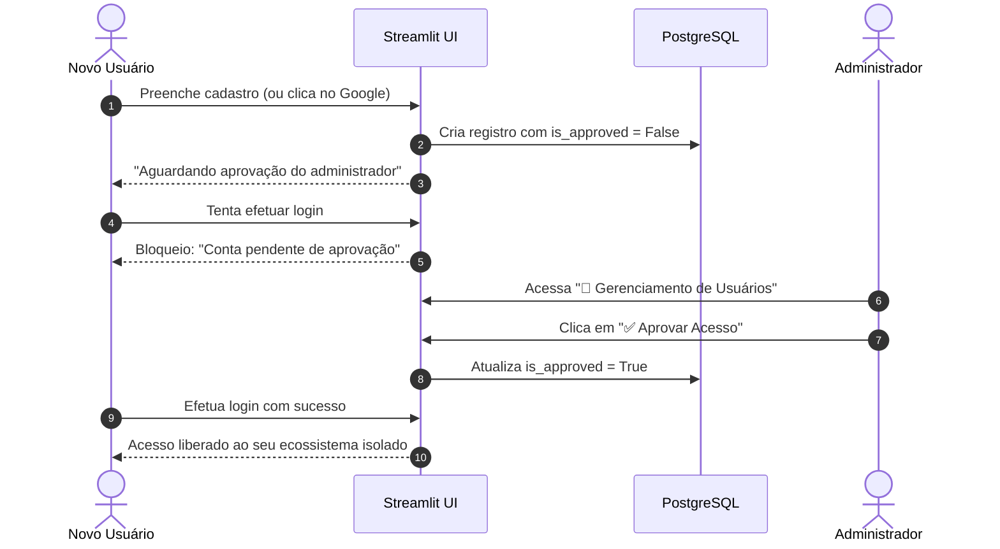

# 🔐 03. Autenticação e Multi-Tenant

Para garantir privacidade total em ambientes locais compartilhados ou em servidores expostos em rede, o **Contas** implementa uma camada completa de **Autenticação, Controle de Acesso e Isolamento Multi-Tenant**.

---

## 🏢 Isolamento Estrito por `user_id`

No **Contas**, não existe compartilhamento ou visibilidade cruzada entre contas de usuários diferentes:
- Toda e qualquer tabela relacional de dados (`account`, `category`, `budget`, `transaction`) possui uma coluna obrigatória `user_id: UUID` com chave estrangeira indexada para a tabela `user`.
- Todas as operações de leitura (`SELECT`), escrita (`INSERT`), atualização (`UPDATE`) e exclusão (`DELETE`) nos repositórios SQLAlchemy filtram obrigatoriamente por `.where(Model.user_id == current_user_id)`.
- É tecnicamente impossível para o `Usuário B` consultar o saldo, extrato ou orçamentos do `Usuário A`.

---

## ⏳ Fluxo de Aprovação Prévia de Novos Usuários

Para impedir que acessos indevidos sejam liberados automaticamente na rede, o sistema opera sob o modelo de **aprovação prévia**:

### Regras do Fluxo:
1. **Primeiro Usuário (Bootstrap)**: O primeiro usuário registrado no sistema recebe automaticamente `role = "admin"` e `is_approved = True`.
2. **Novos Usuários**: Todos os cadastros subsequentes nascem com `is_approved = False`.
3. **Painel do Administrador**: Exclusivo para quem possui `role = "admin"`. Permite aprovar novos acessos, rejeitar e redefinir senhas provisórias com 1 clique.

---

## 🌐 Integração com Google OAuth 2.0

O sistema suporta autenticação social via **OpenID Connect / Google OAuth 2.0**:
- Ao clicar em **"Entrar com o Google"**, o usuário é direcionado para a tela oficial de consentimento do Google (`accounts.google.com`).
- No retorno, o Streamlit intercepta o parâmetro `code` nos query params, realiza a troca por tokens e obtém as informações do perfil (`sub`, `email`, `name`, `picture`).
- Se o usuário já existir no banco e estiver aprovado, o login é imediato. Se for a primeira vez, o cadastro nasce pendente para aprovação do Administrador.

---

## 🔒 Segurança de Senhas

- As senhas são processadas pelo algoritmo `bcrypt` com fator de custo 12 (`rounds=12`) e geração aleatória de salt por credencial.
- O hash é irreversível e verificado via `bcrypt.checkpw()`.
- Usuários autenticados podem atualizar suas próprias senhas no menu de configurações, exigindo validação da senha anterior.
