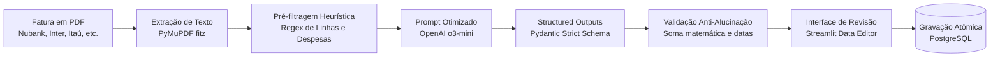

# 🧾 04. Parser de Faturas e IA

A importação manual de despesas de cartão de crédito é um dos maiores pontos de atrito no controle financeiro pessoal. O **Contas** resolve esse desafio com um pipeline automatizado que combina processamento local de documentos em Python com a inteligência do modelo de raciocínio **OpenAI `o3-mini`**.

---

## ⚙️ Arquitetura do Pipeline de Extração

---

## 🧠 Por que usar o modelo OpenAI `o3-mini`?

O modelo `o3-mini` é especializado em tarefas de alta complexidade analítica e raciocínio estruturado:
1. **Compreensão de Tabelas Complexas**: Faturas brasileiras frequentemente possuem layouts com duas ou três colunas na mesma página, misturando transações de titulares e adicionais.
2. **Separação de Compras Parceladas**: Identifica automaticamente menções como `"Parcela 02/10"` e separa a despesa do plano parcelado.
3. **Ignora Ruídos e Metadados**: Discrimina lançamentos reais de pagamentos de fatura anterior, encargos já quitados, pontos de fidelidade e informativos bancários.

---

## 🛡️ Defesas Anti-Alucinação e Integridade

Modelos de linguagem não devem ser confiados cegamente para manipulação contábil. Por isso, o sistema implementa **três camadas de segurança**:

1. **Pré-filtragem em Python**:
   - Linhas que não contêm padrões de data (`DD/MM`) e valor monetário são removidas antes do envio ao modelo, reduzindo o custo de tokens em até 70% e eliminando alucinações de texto corrido.
2. **Schema Estrito com Pydantic**:
   - A resposta da OpenAI é forçada via parâmetro `response_format` para um modelo Pydantic estrito (`InvoiceParseResponse`), garantindo que nenhum campo retorne em formato inconsistente.
3. **Revisão e Seleção Humana (Human-in-the-Loop)**:
   - Os lançamentos são apresentados em uma tabela interativa (`st.data_editor`) com checkboxes, permitindo ao usuário revisar descrições, alterar categorias sugeridas e selecionar apenas os itens que deseja importar.
