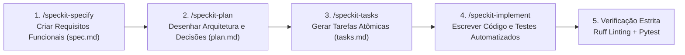

# 📐 06. Metodologia Spec-Driven

Todo o desenvolvimento do **Contas** é guiado pela metodologia **Spec-Driven Development** utilizando o framework **GitHub Spec Kit**.

---

## 🔄 O Ciclo de Desenvolvimento

Diferente do desenvolvimento convencional guiado por código imediato (onde arquitetura e escopo se perdem facilmente), o fluxo do Spec Kit estabelece clareza em 4 fases sequenciais:



---

## 📁 Estrutura de cada Especificação

Cada funcionalidade desenvolvida no projeto possui sua própria pasta versionada dentro do diretório `specs/`:

```text
specs/017-auth-google-oauth-and-registration/
├── spec.md        # Especificação detalhada com Requisitos Funcionais e Não Funcionais
├── plan.md        # Desenho de arquitetura, contratos e fluxos envolvidos
└── tasks.md       # Lista de tarefas atômicas executadas com marcação de progresso [x]
```

---

## 📜 Princípios da Constituição do Projeto

O repositório é regido por regras inegociáveis registradas em `.specify/memory/constitution.md`:
1. **YAGNI & Simplicidade**: Nenhuma abstração desnecessária sem aplicação imediata comprovada.
2. **Precisão Matemática**: Proibição de ponto flutuante binário para moedas.
3. **Idiomas Bem Definidos**:
   - Documentações, especificações e Wiki em **Português do Brasil (PT-BR)**.
   - Código-fonte, variáveis, funções, classes, schemas e testes em **Inglês (EN-US)**.
